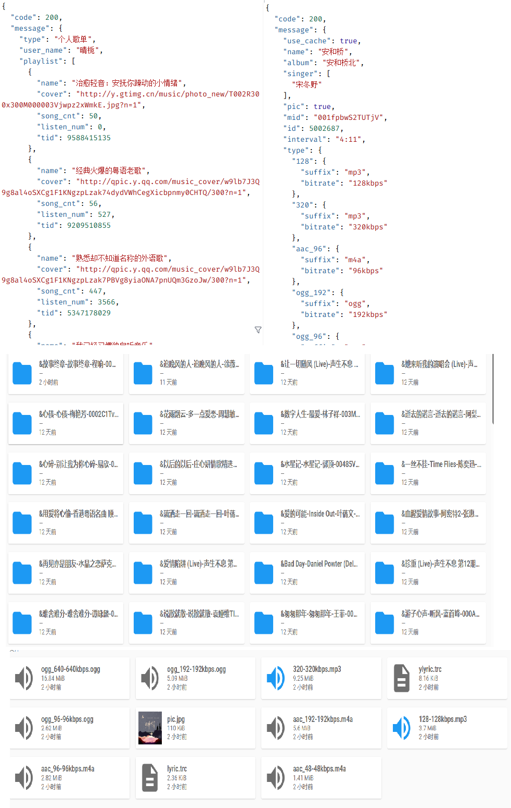

# qq-music-api
一个QQ 音乐的 api 接口以及下载的功能包

## 介绍

本项目仅供学习和研究使用。项目不自带cookies，请自备cookies
如果有任何问题，请及时提出 Issues
项目主要贡献者：[qaq卟言](https://space.bilibili.com/86920865)（B站UP）

[更新日志](update.md)

&emsp;

## 免责声明⚠️
1. 本项目仅供个人学习和技术研究使用
2. 不提供任何VIP/付费音乐资源，相关使用的任何VIP/付费音乐资源由第三方接口提供，并且不保证其接口稳定性
3. 禁止用于商业用途
4. 请遵守相关法律法规，不得用于任何违法用途
5. 做为一个音乐爱好者，我是支持付费的，使用本项目请支持正版音乐，购买相关音乐服务，鼓励大家在经济条件允许的情况下，支持正版音乐，为音乐产业的发展贡献一份力量
6. 建议在本地开发环境或个人服务器上部署使用
7. 本项目不提供线上 demo，请不要轻易信任使用他人提供的公开代理服务，以免发生安全问题
8. 本程序仅提供在线试听服务，未对音乐资源提供下载（存储），收集，传播等服务，所有音乐资源均标注原始链接，不提供任何形式的下载服务

&emsp;

## 项目结构

#### 目录结构
- qq_music：配套的音乐源代码
    - 主要文件
        - index.php：主要的服务器端文件，处理音乐请求和返回结果
        - download.py：VIP/付费音乐资源 下载工具文件，用于下载VIP/付费音乐资源（支持批量下载）
        - update.py：获取新添加的到歌单音乐（不在仓库中的），用于 download.py 下载补充不存在的音乐

&emsp;

## 使用说明

1. 下载项目:
    - 接口源码： [api.zip](https://qaqbuyan.com:88/乔安文件/文件/qq-music/api.zip)

2. 解压到任意目录

3. 修改配置
    - 修改 index.php 音乐的 cookies（需要登入，否则无法获取歌单｛除非你公开个人信息｝）
    - 修改 download.py 的 Music_API 为自己的服务器地址（下载付费音源使用）
    - 修改 update.py 的 Music_API 为自己的服务器地址（更新新歌使用）

4. 上传 index.php 到服务器（需要安装curl扩展）

5. 测试接口是否正常访问

6. 如果需要（批量）播放（下载）VIP/付费音乐资源，需要先运行 download.py 脚本
    - 修改 download.py 脚本中对应的 async def async_main() 函数中的 mids 定义
    - 运行 download.py 脚本(python download.py)
    - 脚本会自动下载音乐资源到当前目录
    - 下载完成后，将音乐资源上传到服务器 index.php 同级的 music 目录下

7. 添加歌单中添加的新歌，请运行 update.py 会得到 mid 列表，使用 download.py 下载即可

&emsp;

## 自带功能

- 音乐接口
    - 📁 音乐缓存
    - 🔍 音乐搜索
    - ❔  分享链接解析
    - 📊 排行榜获取
    - 📑 收藏歌单获取
    - 📰 推荐歌单获取
    - 📰 个人歌单获取
    - ⏰ 新歌获取
    - 💾 缓存仓库获取
    - 🎵 获取歌曲播放链接（支持多种音质）
    - 🎶 特定歌单获取
    - 🎧 获取歌曲音质列表
    - 📝 获取歌词
    - 📊 获取所有歌单信息、用户创建的歌单信息、用户收藏的歌单信息
    - 🖼️ 获取歌曲封面

&emsp;

## 注意事项
1. 本项目不提供任何形式的技术支持：
    - 第三方接口稳定性问题
2. 若将服务部署到公网，强烈建议更改 UA 请求头(这样仅放行允许的 UA 的请求)限制请求范围，以防 api 被他人滥用，导致服务器响应慢或流量被占满等问题

&emsp;

## 其他问题
1. 为什么不直接将项目上传到 GitHub 或 Gitee 等平台？
    - 当然是因为方便我跑路啦，毕竟南山必胜客可不是白叫的，GitHub 上有人也逆向了，后面都停滞了几年不更新了（或者是向其他用户直接告诉，有人给我发律师函了🥴）
👉 [music](https://github.com/sunzongzheng/music)

&emsp;

## 如果代码能帮助到你，欢迎给个star